# Object Detection in an Urban Environment

## Data

For this project, we will be using data from the [Waymo Open dataset](https://waymo.com/open/).

[OPTIONAL] - The files can be downloaded directly from the website as tar files or from the [Google Cloud Bucket](https://console.cloud.google.com/storage/browser/waymo_open_dataset_v_1_2_0_individual_files/) as individual tf records. We have already provided the data required to finish this project in the workspace, so you don't need to download it separately.

## Structure

### Data

The data you will use for training, validation and testing is organized as follow:
```
/home/workspace/data/waymo
    - training_and_validation - contains 97 files to train and validate your models
    - train: contain the train data (empty to start)
    - val: contain the val data (empty to start)
    - test - contains 3 files to test your model and create inference videos
```

The `training_and_validation` folder contains file that have been downsampled: we have selected one every 10 frames from 10 fps videos. The `testing` folder contains frames from the 10 fps video without downsampling.

You will split this `training_and_validation` data into `train`, and `val` sets by completing and executing the `create_splits.py` file.

### Experiments
The experiments folder will be organized as follow:
```
experiments/
    - pretrained_model/
    - exporter_main_v2.py - to create an inference model
    - model_main_tf2.py - to launch training
    - reference/ - reference training with the unchanged config file
    - experiment0/ - create a new folder for each experiment you run
    - experiment1/ - create a new folder for each experiment you run
    - experiment2/ - create a new folder for each experiment you run
    - label_map.pbtxt
    ...
```

## Prerequisites

### Local Setup

For local setup if you have your own Nvidia GPU, you can use the provided Dockerfile and requirements in the [build directory](./build).

Follow [the README therein](./build/README.md) to create a docker container and install all prerequisites.

### Download and process the data

**Note:** ”If you are using the classroom workspace, we have already completed the steps in the section for you. You can find the downloaded and processed files within the `/home/workspace/data/preprocessed_data/` directory. Check this out then proceed to the **Exploratory Data Analysis** part.

The first goal of this project is to download the data from the Waymo's Google Cloud bucket to your local machine. For this project, we only need a subset of the data provided (for example, we do not need to use the Lidar data). Therefore, we are going to download and trim immediately each file. In `download_process.py`, you can view the `create_tf_example` function, which will perform this processing. This function takes the components of a Waymo Tf record and saves them in the Tf Object Detection api format. An example of such function is described [here](https://tensorflow-object-detection-api-tutorial.readthedocs.io/en/latest/training.html#create-tensorflow-records). We are already providing the `label_map.pbtxt` file.

You can run the script using the following command:
```
python download_process.py --data_dir {processed_file_location} --size {number of files you want to download}
```

You are downloading 100 files (unless you changed the `size` parameter) so be patient! Once the script is done, you can look inside your `data_dir` folder to see if the files have been downloaded and processed correctly.

### Classroom Workspace

In the classroom workspace, every library and package should already be installed in your environment. You will NOT need to make use of `gcloud` to download the images.

## Instructions

### Exploratory Data Analysis

You should use the data already present in `/home/workspace/data/waymo` directory to explore the dataset! This is the most important task of any machine learning project. To do so, open the `Exploratory Data Analysis` notebook. In this notebook, your first task will be to implement a `display_instances` function to display images and annotations using `matplotlib`. This should be very similar to the function you created during the course. Once you are done, feel free to spend more time exploring the data and report your findings. Report anything relevant about the dataset in the writeup.

Keep in mind that you should refer to this analysis to create the different spits (training, testing and validation).


### Create the training - validation splits
In the class, we talked about cross-validation and the importance of creating meaningful training and validation splits. For this project, you will have to create your own training and validation sets using the files located in `/home/workspace/data/waymo`. The `split` function in the `create_splits.py` file does the following:
* create three subfolders: `/home/workspace/data/train/`, `/home/workspace/data/val/`, and `/home/workspace/data/test/`
* split the tf records files between these three folders by symbolically linking the files from `/home/workspace/data/waymo/` to `/home/workspace/data/train/`, `/home/workspace/data/val/`, and `/home/workspace/data/test/`

Use the following command to run the script once your function is implemented:
```
python create_splits.py --data-dir /home/workspace/data
```

### Edit the config file

Now you are ready for training. As we explain during the course, the Tf Object Detection API relies on **config files**. The config that we will use for this project is `pipeline.config`, which is the config for a SSD Resnet 50 640x640 model. You can learn more about the Single Shot Detector [here](https://arxiv.org/pdf/1512.02325.pdf).

First, let's download the [pretrained model](http://download.tensorflow.org/models/object_detection/tf2/20200711/ssd_resnet50_v1_fpn_640x640_coco17_tpu-8.tar.gz) and move it to `/home/workspace/experiments/pretrained_model/`.

We need to edit the config files to change the location of the training and validation files, as well as the location of the label_map file, pretrained weights. We also need to adjust the batch size. To do so, run the following:
```
python edit_config.py --train_dir /home/workspace/data/train/ --eval_dir /home/workspace/data/val/ --batch_size 2 --checkpoint /home/workspace/experiments/pretrained_model/ssd_resnet50_v1_fpn_640x640_coco17_tpu-8/checkpoint/ckpt-0 --label_map /home/workspace/experiments/label_map.pbtxt
```
A new config file has been created, `pipeline_new.config`.

### Training

You will now launch your very first experiment with the Tensorflow object detection API. Move the `pipeline_new.config` to the `/home/workspace/experiments/reference` folder. Now launch the training process:
* a training process:
```
python experiments/model_main_tf2.py --model_dir=experiments/reference/ --pipeline_config_path=experiments/reference/pipeline_new.config
```
Once the training is finished, launch the evaluation process:
* an evaluation process:
```
python experiments/model_main_tf2.py --model_dir=experiments/reference/ --pipeline_config_path=experiments/reference/pipeline_new.config --checkpoint_dir=experiments/reference/
```

**Note**: Both processes will display some Tensorflow warnings, which can be ignored. You may have to kill the evaluation script manually using
`CTRL+C`.

To monitor the training, you can launch a tensorboard instance by running `python -m tensorboard.main --logdir experiments/reference/`. You will report your findings in the writeup.

### Improve the performances

Most likely, this initial experiment did not yield optimal results. However, you can make multiple changes to the config file to improve this model. One obvious change consists in improving the data augmentation strategy. The [`preprocessor.proto`](https://github.com/tensorflow/models/blob/master/research/object_detection/protos/preprocessor.proto) file contains the different data augmentation method available in the Tf Object Detection API. To help you visualize these augmentations, we are providing a notebook: `Explore augmentations.ipynb`. Using this notebook, try different data augmentation combinations and select the one you think is optimal for our dataset. Justify your choices in the writeup.

Keep in mind that the following are also available:
* experiment with the optimizer: type of optimizer, learning rate, scheduler etc
* experiment with the architecture. The Tf Object Detection API [model zoo](https://github.com/tensorflow/models/blob/master/research/object_detection/g3doc/tf2_detection_zoo.md) offers many architectures. Keep in mind that the `pipeline.config` file is unique for each architecture and you will have to edit it.

**Important:** If you are working on the workspace, your storage is limited. You may to delete the checkpoints files after each experiment. You should however keep the `tf.events` files located in the `train` and `eval` folder of your experiments. You can also keep the `saved_model` folder to create your videos.


### Creating an animation
#### Export the trained model
Modify the arguments of the following function to adjust it to your models:

```
python experiments/exporter_main_v2.py --input_type image_tensor --pipeline_config_path experiments/reference/pipeline_new.config --trained_checkpoint_dir experiments/reference/ --output_directory experiments/reference/exported/
```

This should create a new folder `experiments/reference/exported/saved_model`. You can read more about the Tensorflow SavedModel format [here](https://www.tensorflow.org/guide/saved_model).

Finally, you can create a video of your model's inferences for any tf record file. To do so, run the following command (modify it to your files):
```
python inference_video.py --labelmap_path label_map.pbtxt --model_path experiments/reference/exported/saved_model --tf_record_path /data/waymo/testing/segment-12200383401366682847_2552_140_2572_140_with_camera_labels.tfrecord --config_path experiments/reference/pipeline_new.config --output_path animation.gif
```

## Project writeup

### Overview
This project involves development of an object detection model based on the convolutional neural network for autonomous driving system. The architecture of this model is  **SSD Resnet50**.  Dataset used in this project is Waymo Open Dataset, which includes various scenes of urban environments consisting vehicles, pedestrians and cyclists. The model is trained on the tensorflow object detection API to detect and classify vehicles, pedestrians and cyclists.

Perception is the fundamental step in the autonomous driving system pipeline. Just like visual system is for humans, perception and vision related algorithms are for computers to detect and classify objects on the road and support self_driving car to make a correct decision on its own.

### Set up
GPU compatible system is necessary for this

   * First the project files should be downloaded through git clone from [this](https://github.com/udacity/nd013-c1-vision-starter) repository
   * Navigate to the root directory of the project and use the docker file and requirements.txt from the "build" directory
   * The following command should be run from inside the "build" directory:
    ``` docker build -t project-dev -f Dockerfile .```
   * Then we create a docker container to run the created image.
    ``` 
    docker run --gpus all -v <PATH TO LOCAL PROJECT FOLDER>:/app/project/ --network=host -ti project-dev bash
   ```
   * Inside the container, we can use the gsutil command to download the tfrecord from cloud storage:
    ``` 
    curl https://sdk.cloud.google.com | bash
   ```
   -Authentication can be done using
   ```
    pip install tensorflow-gpu==2.3.0
    pip install numpy
    pip install pandas
    pip install matplotlib
    pip install seaborn 
   ```
To run the code in this repository:

  - `step1`: **Exploratory data analysis**
  ```
  jupyter notebook --port 3002 --ip=0.0.0.0 --allow-root
  ```

  - `step2`: **create a split for train and val in waymo**
  ```
  python create_splits.py --data-dir /home/workspace/data/waymo
  ```

  - `step3`: **edit the config file**
  ```
  python edit_config.py --train_dir /home/workspace/data/waymo/train/ --eval_dir /home/workspace/data/waymo/val/ --batch_size 2 --checkpoint /home/workspace/experiments/pretrained_model/ssd_resnet50_v1_fpn_640x640_coco17_tpu-8/checkpoint/ckpt-0 --label_map /home/workspace/experiments/label_map.pbtxt
  ```

  - `step4`: **train and validation the model**

    - _train process_
    ```
    python experiments/model_main_tf2.py --model_dir=experiments/reference/ --pipeline_config_path=experiments/reference/pipeline_new.config
    ```

    - _validation process_
    ```
    python experiments/model_main_tf2.py --model_dir=experiments/reference/ --pipeline_config_path=experiments/reference/pipeline_new.config --checkpoint_dir=experiments/reference/
    ```

  - `step5`: **export the trained model**(Final model in experiment4)

### Dataset
#### Dataset analysis
- We can observe that some images have a good resolution, some images are blurry due to the weather condition and some images are dark. Vehicles are in red bounding boxes, pedestrians are in green bounding boxes, cyclists are in blue bounding boxes.

   <div align=center>
      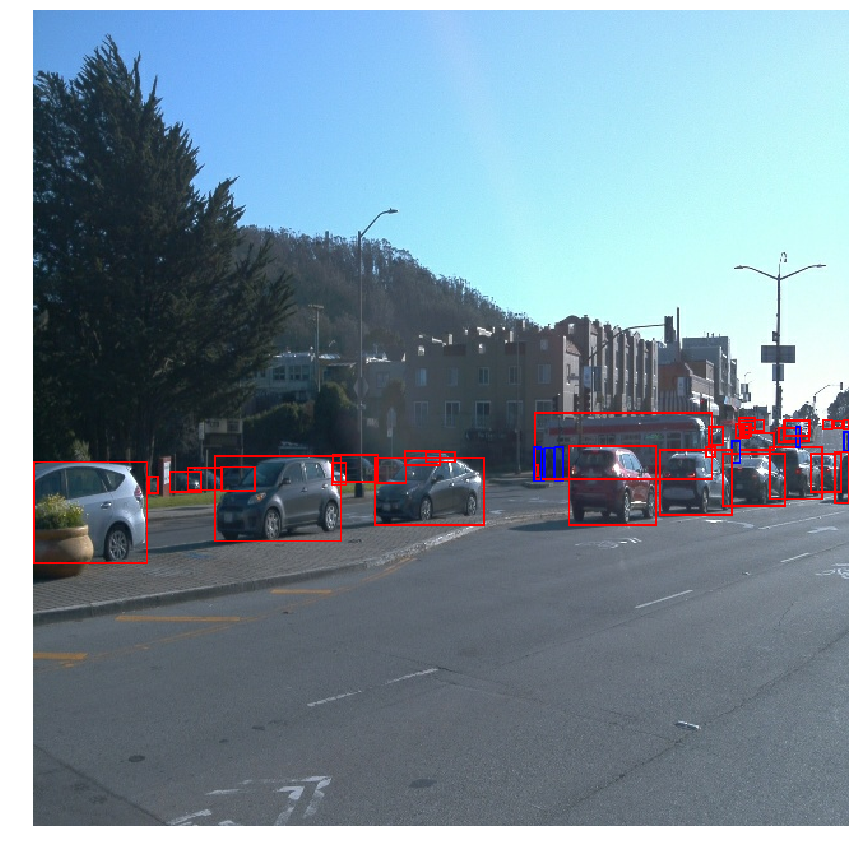
   </div>

  - From the bar chart below, we could observe that the dataset we've downloaded has a large number of vehicles and pedestrains, but very limited number of cyclists.
   
   <div align=center>
      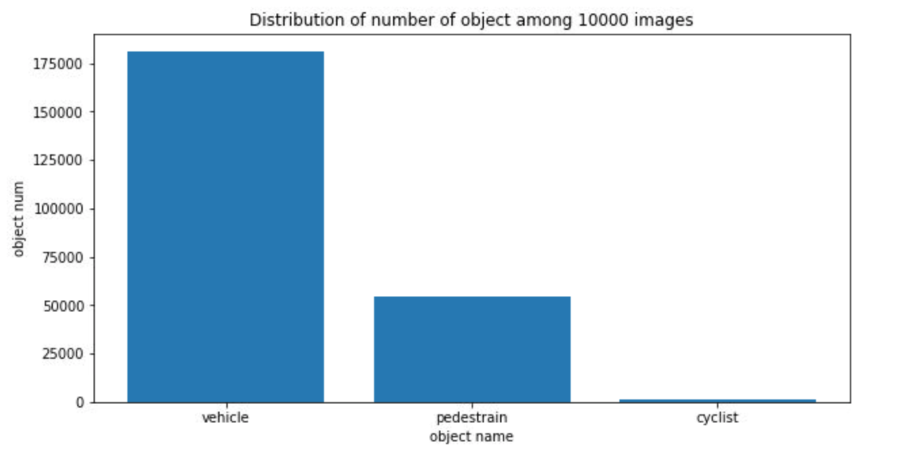
   </div>
#### Cross validation
By using 100 tfrecord, we use [sklearn.model_selection.train_test_split](https://scikit-learn.org/stable/modules/generated/sklearn.model_selection.train_test_split.html) shuffle data by default=True to generalize data and create three splits from the processed records into train, val and test to reduce the imbalance class in each sample. Since we only use 100 tfrecords, we split the train data to 60 tfrecords and 20 tfrecords for test and validate dataset to ensure we have enough data for training and enough data for test and validate.

### Training
#### Reference experiment
The reference experiment uses the `ssd_resnet50_v1_fpn_640x640_coco17_tpu-8` pretrained model as a baseline and uses the default training parameters in the `pipeline.config`.
- The batch size is 4 in the SSD Resnet 50 640x640 baseline model, training steps up to 3200 in the Udacity workspace.
- Sometimes it is unable to run train and eval commands at the same time. Udacity workspace will throw out of memory (OOM).  As a result, this cause eval to have only 1 blue dot. Running eval command after training finished. The error persists even for a smaller batch size of 2. 

The following plots shows various metrics and figures obtained with training using reference experiment. 
#### Loss
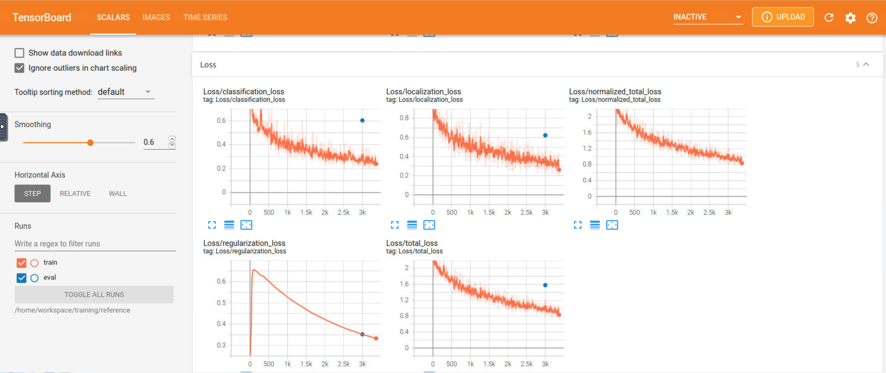

#### Precision
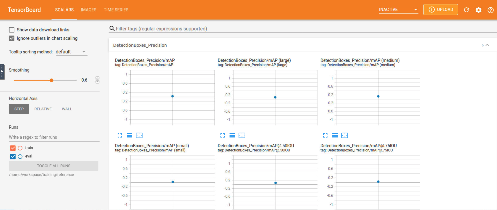
#### Recall
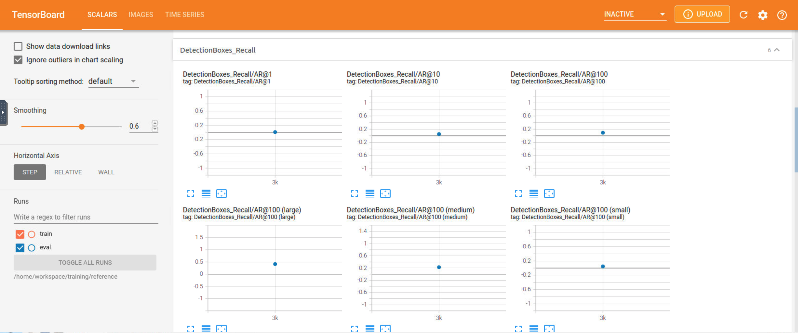
#### Learning Rate
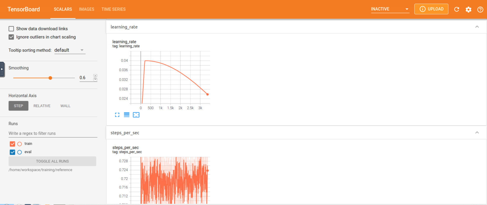
#### Evaluation  
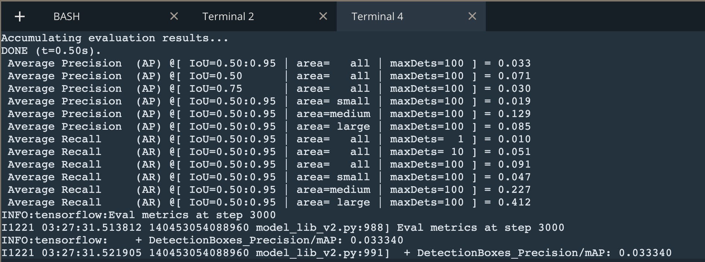
  
#### Improve on the reference
We use `Explore augmentations2.ipynb` tried different data augmentation combinations to optimal for our dataset. The changed parameters are stored in the new config file in `/experiments/improved/performance_improve.config`.  

In this section We applied the following Augmentations from [preprocessor.proto](https://github.com/tensorflow/models/blob/master/research/object_detection/protos/preprocessor.proto)
such as add a random RGB to gray transform with a probability of 0.2:
```
data_augmentation_options {
    random_rgb_to_gray {
    probability: 0.2
    }
  }
```
- Add random_pixel_value_scale and random_image_scale to default value.
```
  data_augmentation_options {
    random_pixel_value_scale {
    }
  }
  data_augmentation_options {
    random_image_scale {
    }
  }
```
- Brightness adjusted to 0.3  
```
  data_augmentation_options {
    random_adjust_brightness {
    max_delta: 0.3
    }
  }
```
- Add random_adjust_hue, random_adjust_contrast and random_adjust_saturation to default value. 
```
 data_augmentation_options {
   random_adjust_hue {
   }
 }
 data_augmentation_options {
   random_adjust_contrast {
   }
 }
 data_augmentation_options {
   random_adjust_saturation {
   }
 }
```
-  Add a random contrast values between 0.6 ~ 1.0   
```
  data_augmentation_options {
    random_adjust_contrast {
    min_delta: 0.6
    max_delta: 1.0
    }
  }
```

- Add random_jpeg_quality with min_jpeg_quality to 80
```
data_augmentation_options {
    random_jpeg_quality {
      min_jpeg_quality: 80
    }
  }
```
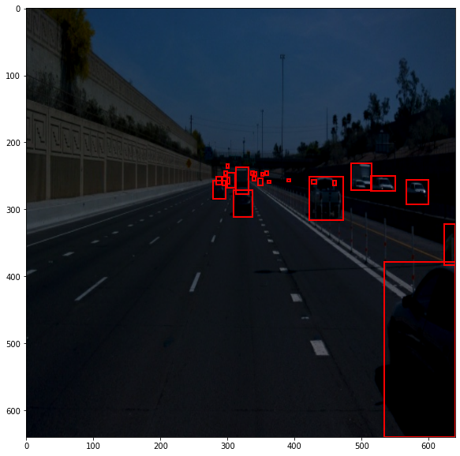
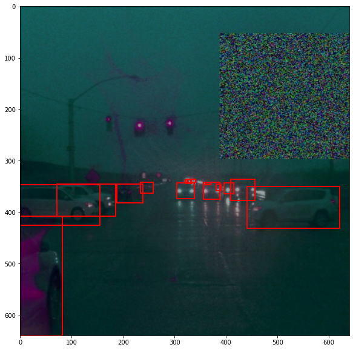
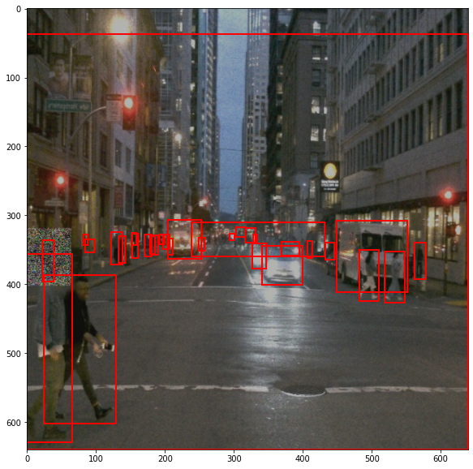
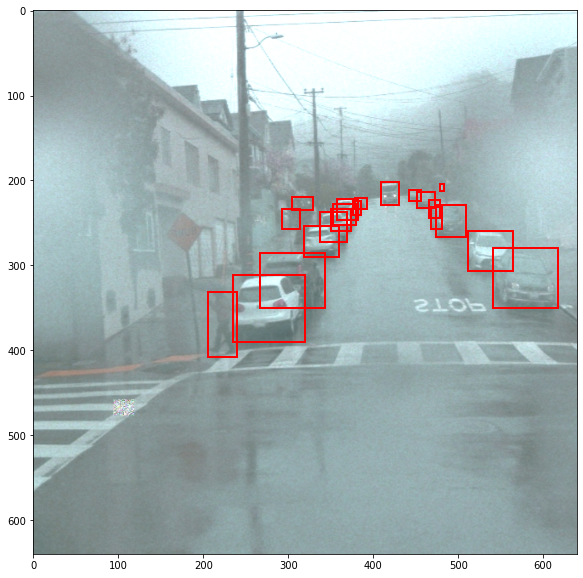

- Only adjust random_rgb_to_gray, random_adjust_brightness and contrast  
```
  data_augmentation_options {
    random_rgb_to_gray {
    probability: 0.2
    }
  }
  data_augmentation_options {
    random_adjust_brightness {
    max_delta: 0.3
    }
  }
  data_augmentation_options {
    random_adjust_contrast {
    min_delta: 0.6
    max_delta: 1.0
    }
  }
```  
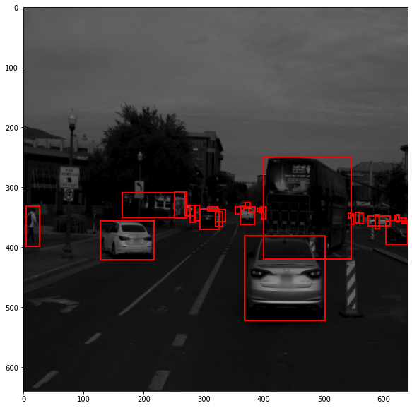
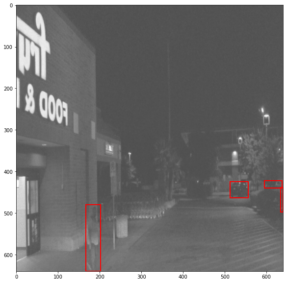
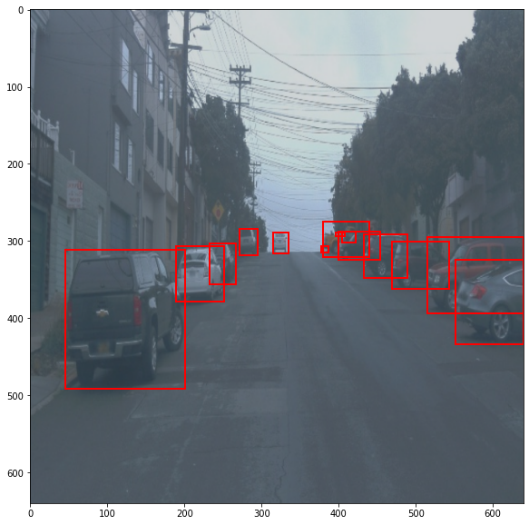
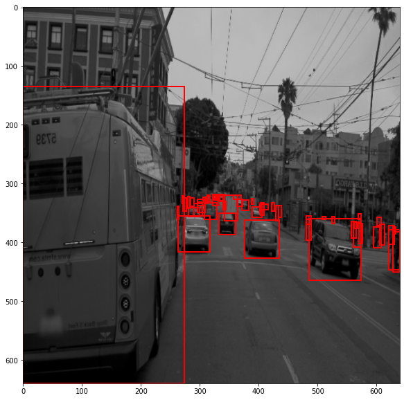

- **Experiment2** 
  
    - Model: **`ssd_resnet50_v1_fpn_640x640_coco17_tpu-8`**
    - Pipeline: [here](./experiments/experiment2/pipeline_new.config) 
  
    **Main changes**:
    ```
      1. Try different data_augmentation
         * random_adjust_brightness
         * random_rgb_to_gray
      2. Change optimizer: momentum --> adam
      3. Change learning rate: cosine_decay, base(0.04) --> Manual_step, base(0.002)
      4. Increase training_step to 25K
     ```
    
    Try different data_augmentation combination, different optimizer and learning rate, to see what effects will have. From the result, seems not much help with these changes.
  
    ***Results displayed on the tensorboard***:

    #### Loss
    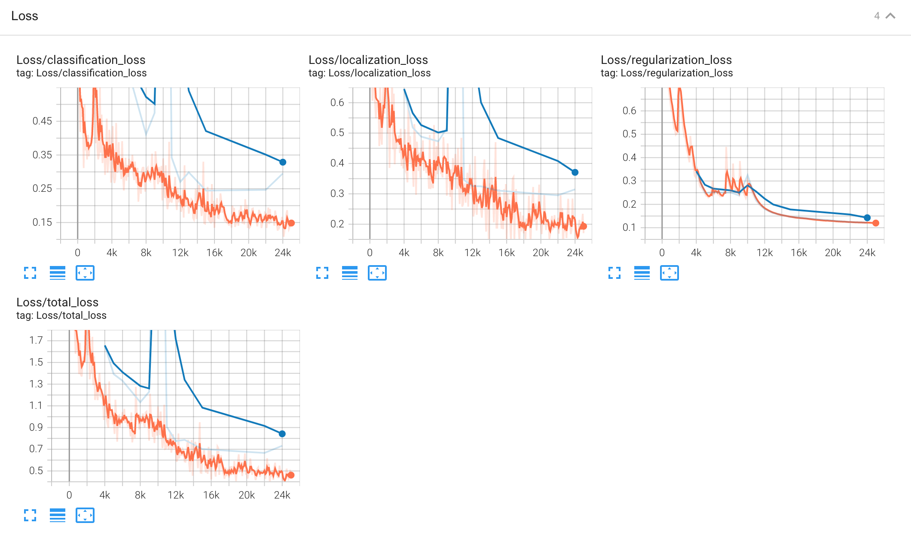
    #### Precision
    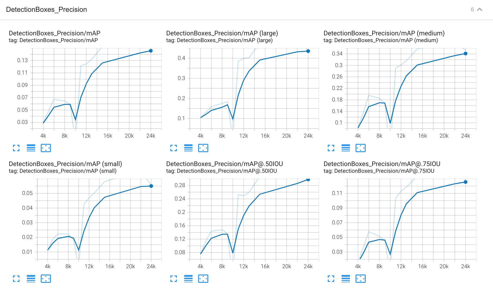
    #### Recall
    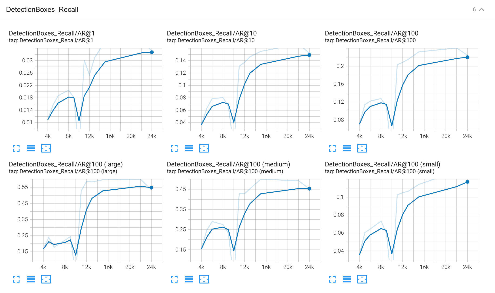
    #### Learning_rate 
   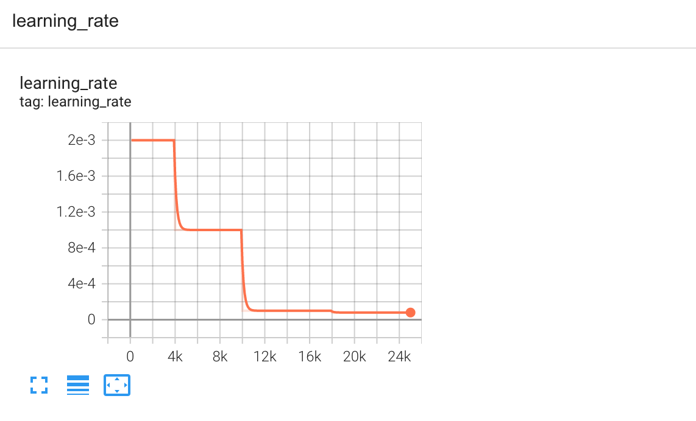